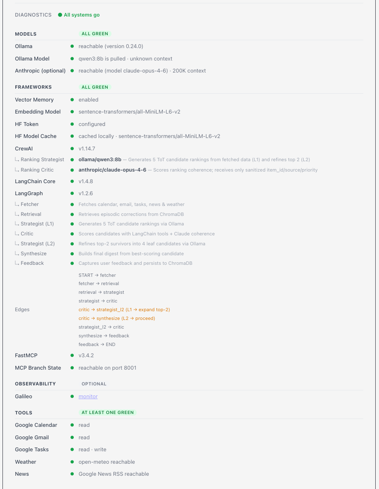
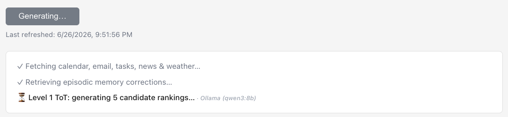
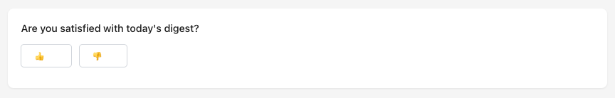
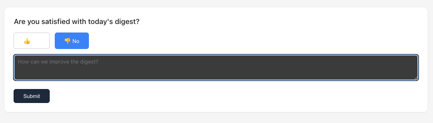
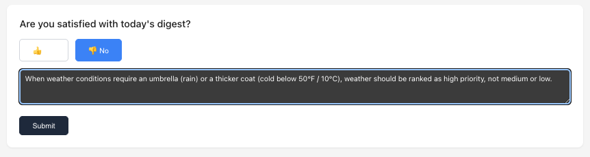

# cmu-agentic-ai

> **For the teaching assistant:** This is a CMU Agentic AI capstone project. This README is written to help you run and evaluate the project locally from scratch. Follow the sections in order — System Requirements → Prerequisites → Quickstart → Environment Variables → Google Services Setup → Run. Everything needed to get the app running is covered here.

Daily Digest agent that gathers data from Google services, weather, and news, then synthesizes a prioritized briefing using a **two-level Tree-of-Thought (ToT) ranking pipeline**:

- **L1** — Ranking Strategist (Ollama/qwen3:8b) generates 5 candidate rankings; Ranking Critic (Claude) scores all 5 and prunes to the top 2
- **L2** — Strategist refines each of the 2 survivors into 2 variants (4 leaf candidates total); Critic selects the best one to synthesize into the final digest

This two-level search was motivated by quality: a single-pass ranking produced inconsistent results, while the L1→prune→L2→select pattern significantly improved coherence and prioritization.

Two different LLMs are used deliberately — each matched to its role:
- **Ranking Strategist → Ollama/qwen3:8b (local):** Generation is the high-volume work — 5 candidates at L1, 4 refinements at L2. Running this locally keeps it free, fast, and private. Your emails and calendar data never leave your machine during generation. The Strategist receives at most ~24 items total (calendar capped at 5, email at 5, tasks at 5, news at 8, plus weather and location context) — this bounded input is why 128K context is sufficient rather than requiring a larger window. In a real production environment where more items per source are needed, the caps can be raised in `fetcher_agent.py` — but a larger context window model would then be required, or a pre-filtering/summarization step should be added before ranking to keep the prompt within bounds.
- **Ranking Critic → Claude (cloud):** Scoring and selection require stronger reasoning and coherence judgment. The default model is `claude-opus-4-6` (200K context), overridable via `ANTHROPIC_MODEL`. Claude is used here precisely because it outperforms smaller local models at nuanced evaluation tasks. Since the Critic only receives sanitized item IDs, sources, and priority scores — not raw personal content — the privacy risk is minimal. The 200K context is not a requirement — the Critic actually sees far less data than the Strategist. The Strategist needs 128K to process raw email previews, event titles, and task content. The Critic only receives sanitized item IDs and priority scores (personal data is stripped before it ever reaches Claude), so its prompt is compact even with all 4 L2 candidates combined. The 200K is simply a characteristic of claude-opus-4-6. Any Claude model works here — a smaller, cheaper model such as `claude-haiku-4-5` would be sufficient for the Critic's scoring task if cost is a concern.

This **local-for-generation, cloud-for-evaluation** pattern is directly applicable to real enterprise environments where sensitive internal data (emails, documents, customer records) cannot be sent to public cloud LLM APIs due to compliance, data residency, or confidentiality requirements. The local model handles the data-heavy work; the cloud model only sees abstracted, sanitized signals.

> **A note on scope:** This project is deliberately over-engineered. A working daily digest could be built with a single LLM call. The goal here was to learn by doing — exploring LangGraph, CrewAI, FastMCP, episodic memory, shadow mode agent evaluation, and two-level Tree-of-Thought search all in one project. If something seems more complex than it needs to be, that's intentional.

## System Requirements

| | Minimum | Recommended |
|---|---|---|
| **OS** | macOS 12+ or Linux | macOS (Apple Silicon M1+) |
| **RAM** | 8 GB | 16 GB |
| **Disk** | 6 GB free | 10 GB free |
| **CPU** | Any modern x86-64 or ARM | Apple Silicon (M1+) — Ollama uses the GPU, making inference 3–5× faster |
| **Internet** | Required | — |

> **RAM note:** The local LLM (`qwen3:8b`) alone occupies ~5GB of RAM. On an 8GB machine the OS may swap under load; 16GB gives comfortable headroom.

## Prerequisites

Install these before cloning:

| Tool | Version | Install |
|---|---|---|
| **Python** | **3.12 exactly** | [python.org](https://www.python.org/downloads/) or `brew install python@3.12` |
| **Node.js** | 18+ | [nodejs.org](https://nodejs.org/) or `brew install node` |
| **Ollama** | latest | [ollama.com](https://ollama.com/) — install the Mac app or `brew install ollama` |
| **git** | any | pre-installed on macOS; or `brew install git` |

> **Python 3.12 is required.** The setup script calls `python3.12` explicitly to create the virtual environment. Other versions will fail.

Verify your versions before proceeding:

```bash
python3.12 --version   # must print Python 3.12.x
node --version         # must print v18 or higher
ollama --version       # any version
```

After installing Ollama, pull the recommended model (≈5GB download):

```bash
ollama pull qwen3:8b
```

> **Why qwen3:8b?** It has a 128K context window — large enough to hold a full day's worth of emails, calendar events, and tasks in a single prompt. Most other 8B models top out at 8K–32K, which causes truncation on busy days and significantly degrades ranking quality (this was observed firsthand during development — smaller context models produced poor, incomplete digests). qwen3:8b also benchmarks well on instruction-following tasks, which matters for the Tree-of-Thought ranking steps.

> **Note:** News (Google News RSS) and weather (open-meteo) are free public APIs — no keys required.

## Quickstart

```bash
# 1. Clone the repo
git clone https://github.com/johndklee/cmu-agentic-ai.git
cd cmu-agentic-ai

# 2. Install Python dependencies including CrewAI (creates .venv312/)
bash scripts/setup_claude_code.sh --with-crewai

# 3. Install Node dependencies
cd web && npm install && cd ..

# 4. Create .env (see Environment Variables section below)
cp .env.example .env   # then fill in your keys

# 5. Set up Google credentials (see Google Services Setup section below)

# 6. Run
./run.sh
```

The app runs at **http://localhost:8000**. At startup it shows a diagnostics panel confirming all services are connected.

> **First run note:** On first startup the embedding model (`sentence-transformers/all-MiniLM-L6-v2`, ~90MB) downloads automatically from HuggingFace. The app will appear to hang for 30–60 seconds with no output — this is normal. Subsequent starts are instant.



> **macOS/Linux only.** `run.sh` requires zsh. On Windows, start Ollama manually and run the backend and frontend separately (see Run section below).

## Environment Variables

Copy `.env.example` to `.env` and fill in your keys. This file is in `.gitignore` and will never be committed.

```bash
cp .env.example .env
```

| Variable | Required | Description |
|---|---|---|
| `ANTHROPIC_API_KEY` | **Yes** | Claude API key for the Ranking Critic — get at [console.anthropic.com](https://console.anthropic.com) |
| `OLLAMA_MODEL` | **Yes** | Local model for the Ranking Strategist — e.g. `qwen3:8b` |
| `OLLAMA_BASE_URL` | No | Ollama server URL (default: `http://localhost:11434`) |
| `OLLAMA_NUM_CTX` | No | Context window override (uses model default if not set) |
| `HF_TOKEN` | No | HuggingFace token for higher download rate limits — get at [huggingface.co/settings/tokens](https://huggingface.co/settings/tokens) |
| `GALILEO_OBSERVABILITY_ENABLED` | No | Set to `1` to emit LLM trace events to Galileo |
| `GALILEO_API_KEY` | No | Required when Galileo observability is enabled |
| `GALILEO_CONSOLE_URL` | No | Your Galileo project URL |
| `GALILEO_INCLUDE_CONTENT` | No | Set to `1` to include raw prompt/response in Galileo events |

## LLM Configuration

The two agents use different models — this section explains how to configure them and what each env var controls at runtime.

Runtime model configuration is per-agent:

- Strategist uses Ollama (`OLLAMA_MODEL`, default `llama3.1:8b`)
- Critic uses Claude (`ANTHROPIC_MODEL`, default `claude-opus-4-6`)
- `OLLAMA_BASE_URL` and `OLLAMA_NUM_CTX` tune Ollama runtime behavior
- Optional Galileo observability:
	- `GALILEO_OBSERVABILITY_ENABLED=1` enables event emission (no-op when Galileo SDK is not installed)
	- `GALILEO_INCLUDE_CONTENT=1` includes raw prompt/response content in events
	- Default behavior is metadata-only (`prompt_chars`, `response_chars`, hashes, latency, status)

## Google Services Setup

The agent reads Gmail, Google Calendar, and Google Tasks via OAuth 2.0. Tasks also requires **write** access — the agent automatically creates follow-up tasks when a VIP attendee on a calendar event has a recent email thread. Setup is one-time and must be completed before the first run.

The following OAuth scopes are requested:

| Scope | Why |
|---|---|
| `gmail.readonly` | Read inbox for email ranking |
| `gmail.send` | Send the daily digest email (if opted in) |
| `calendar.readonly` | Read upcoming events for ranking |
| `tasks` | Read open tasks + create VIP follow-up tasks (read/write) |

**1. Create a Google Cloud Project**
- Go to [console.cloud.google.com](https://console.cloud.google.com) and create a new project

**2. Enable the APIs**
- Go to **APIs & Services → Library** and enable:
  - Gmail API
  - Google Calendar API
  - Tasks API

**3. Create OAuth 2.0 Credentials**
- Go to **APIs & Services → Credentials → Create Credentials → OAuth client ID**
- If prompted, configure the OAuth consent screen first:
  - User type: **External**
  - Add your Google account email as a test user
  - Add the four scopes listed above under **Scopes**
- Application type: **Desktop app**
- Click **Create** then **Download JSON**
- Rename the downloaded file to `credentials.json` and place it in the project root

**4. Authenticate**
- Run the app — a browser window will open asking you to sign in with Google
- Google will show a **"This app isn't verified"** warning screen — this is expected for a personal Cloud project in test mode. Click **Advanced** → **Go to (project name) (unsafe)** to proceed
- Approve all requested permissions including Tasks read/write — this is required for VIP follow-up task creation
- After approving, `token_google.json` is saved automatically
- Subsequent runs authenticate silently with no browser prompt

Both `credentials.json` and `token_google.json` are in `.gitignore` and will never be committed.

## Ports

| Port | Service | Notes |
|---|---|---|
| **8000** | FastAPI backend + served frontend | Main app URL in production — `http://localhost:8000` |
| **5173** | Vite dev server (frontend only) | Only used when running frontend separately with `npm run dev` |
| **8001** | FastMCP branch state server | Internal only — used by LangGraph nodes to share ToT candidate state; not exposed to the browser |
| **11434** | Ollama | Local LLM server — used by the Ranking Strategist agent |

`run.sh` kills any existing processes on ports 8000 and 8001 before starting.

## Run

```bash
./run.sh
```

This starts Ollama (if not already running), builds the frontend, and launches the FastAPI backend on port 8000.

Or start backend and frontend separately in dev mode:

```bash
.venv312/bin/uvicorn server:app --reload   # backend on :8000
cd web && npm run dev                       # frontend on :5173
```

## Your First Daily Digest

Once the app is running at **http://localhost:8000**:

1. **Check diagnostics** — the Diagnostics panel loads automatically. Confirm all sections show green before proceeding. Fix any red items (missing credentials, Ollama not reachable, etc.)

2. **Set your preferences** — expand the **Current Preferences** panel and click **Settings**:
   - Enter your name and email address
   - Set your location (used for weather)
   - Add VIP email addresses (people whose emails get priority in ranking)
   - Choose temperature unit and number of key highlights
   - Check **Email daily digest** to receive the digest in your inbox after each run — the digest is sent from and to the email address you entered above, which must be the same Google account you authorized during Google OAuth setup

3. **Generate your first digest** — go back to the main page and click **Generate Digest**
   - Each pipeline step streams live as it runs — completed steps show a checkmark, the active step shows a spinner with the LLM being used

   

   - The pipeline runs: fetches Gmail, Calendar, Tasks, News, and Weather → L1 ToT generates 5 rankings → Critic prunes to top 2 → L2 ToT refines to 4 leaf candidates → Critic selects best → synthesizes final digest
   - First run takes 1–2 minutes as the LLM processes all candidates
   - The digest appears on screen when complete

4. **Submit feedback** — after reviewing the digest, a feedback form appears at the bottom. Rate the digest with a thumbs up or down. Clicking thumbs down expands a text field to describe what to improve — this note is stored in episodic memory and used to influence future rankings.

   

   

   The more specific the feedback, the better — the episodic memory matches on keywords from the current run context. For example, to teach the agent to prioritize weather on bad weather days:

   > *"When weather conditions require an umbrella (rain) or a thicker coat (cold below 50°F / 10°C), weather should be ranked as high priority, not medium or low."*

   

   Vague notes like "improve weather" are less effective — specific condition + priority instructions retrieve reliably on future runs.

> **Last run persistence:** On first launch there is no cached digest — the main page will be blank until you generate one. After the first successful run, the digest is stored and displayed automatically on every subsequent load. You do not need to regenerate it each time.

## Safety & Design Decisions

### Privacy Boundary (Structural)

Claude only receives a numbered list of items with rankings (high/medium/low) — no email content, no sender names, no event titles, no task details. All personal data is stripped before the API call by `prompt_redaction.py`. This is enforced in code, not policy — the cloud model cannot receive raw personal data regardless of what other parts of the system do.

### LLM Output Validation

All outputs from the Ollama strategist are validated before use:
- Priority values are checked against an allowlist (`high`, `medium`, `low`)
- Item IDs are checked against the set of actually fetched items
- Candidates with invalid entries are silently dropped
- If fewer than 5 valid candidates are returned or JSON is unparseable, a deterministic fallback ranking is substituted
- Coherence scores are clamped to `[0.0, 1.0]` regardless of source
- If both Claude and the Ollama fallback fail, the critic returns a neutral score of `0.5` so the pipeline continues using deterministic scoring dimensions alone

### Data Scope Limits

To prevent context overflow and scope creep:
- Calendar queries are bounded to **31 days ahead**
- Email body previews are capped at **3 lines / 280 characters**; HTML and URLs are stripped
- Calendar, email, and tasks sources are each capped at **5 items**; news fetches up to **8 articles**
- The ranking LLM receives at most ~**24 items total**

### Human Intervention Boundaries

The agent never modifies its own behavior autonomously. Human action is required at three boundaries:

- **Memory writes** — episodic memory is only updated when the user explicitly submits feedback via the web UI after reviewing the digest. Automatic saving was considered and rejected: if a run is poor quality, saving it automatically would teach the agent the wrong lessons.
- **Preference changes** — location, VIP contacts, highlight count, and digest preferences are only saved through the Settings UI or the post-digest feedback form on explicit user action.
- **Shadow promotion** — the key highlights shadow agent never auto-promotes. Promotion requires two consecutive passing weekly quality reports; a human must observe the metrics trend before any behavioral change takes effect.

### Scoped Autonomy Exception: VIP Task Creation

The one autonomous write the agent performs is creating a Google Task when a VIP attendee on a calendar event also has a recent email thread — a reminder to follow up before the event. This is bounded by three constraints: it only triggers on the explicit VIP+email overlap condition, it is idempotent (a deterministic marker in the task notes prevents duplicates across runs), and it creates a reminder rather than taking action on the user's behalf.

### Evaluation Metrics

The following are tracked or observable:

| Metric | Description | Gate |
|---|---|---|
| Fallback rate | % of runs where deterministic fallback replaced LLM candidates | — |
| Schema validity rate | % of shadow agent outputs that are correctly formatted | ≥95% |
| Promotion pass rate | % of shadow outputs good enough to replace the current approach | ≥70% |
| Timeout rate | % of shadow calls exceeding the 2.5s timeout | ≤5% |
| Pipeline completion rate | % of runs reaching the feedback node without a RuntimeError | — |
| Episodic correction utilization | ChromaDB corrections retrieved per run (zero = retrieval not matching) | — |
| User satisfaction rate | Ratio of satisfied to total feedback submissions | — |

### Does Agent Quality Degrade Over Time?

This was a deliberate design concern. Several mechanisms work together to prevent it:

- **Episodic memory is write-protected from bad runs** — corrections are only stored when the user explicitly submits feedback after reviewing the digest. A failed or low-quality run teaches the agent nothing.
- **Recency weighting decays stale corrections** — stored feedback loses influence over time (full weight ≤30 days, 0.75x ≤60 days, 0.55x older, flagged stale beyond that). Outdated preferences don't permanently skew future rankings.
- **Shadow promotion requires sustained quality** — Agent B cannot replace the deterministic highlights path unless it passes quality gates over two consecutive weekly reports. A single good run is not enough.
- **LLM output is validated every run** — malformed or out-of-range outputs are caught and replaced with deterministic fallbacks rather than being passed downstream.
- **Hard item limits prevent context drift** — the ranking prompt is bounded to ~24 items regardless of how much data accumulates in Gmail or Calendar over time.

The net effect is that the agent can improve through feedback but has no mechanism to silently degrade — quality changes require either explicit user action or sustained metric improvement.

### Key Trade-offs

- **Autonomy vs. reliability:** The agent halts rather than produces output under uncertain conditions. A failed run is preferable to a plausibly incorrect one.
- **Efficiency vs. privacy:** Stripping personal data from critic inputs removes context that might improve coherence scoring. The privacy guarantee was prioritized — the boundary is structural and cannot be bypassed by model output.
- **Automation vs. oversight:** Requiring explicit user feedback for episodic memory updates slows learning. A user who never submits feedback always gets default behavior. This trade-off was accepted because automatic learning from implicit signals would require behavioral tracking that raises its own privacy concerns.

## Maintenance

Reset preferences if needed:

```bash
.venv312/bin/python main.py --reset-preferences digest
```

## Tests

```bash
.venv312/bin/python -m unittest discover -s tests -p "test_*.py"
```

## Shadow Metrics Ops

The shadow mode agent (Agent B) runs silently alongside every digest run and logs its output to `.memory/key_highlights_shadow.jsonl`. These commands exist to monitor whether Agent B is performing well enough to replace the current deterministic key highlights approach. Before any PR that changes shadow behavior, the CI snapshot must be refreshed locally — otherwise the CI gate will fail.

Prepare the CI contract log snapshot:

```bash
.venv312/bin/python scripts/prepare_ci_shadow_log.py --source .memory/key_highlights_shadow.jsonl --output ci/key_highlights_shadow.jsonl --tail 50
```

Summarize shadow metrics and write a JSON report:

```bash
.venv312/bin/python scripts/summarize_shadow_metrics.py --log-path ci/key_highlights_shadow.jsonl --tail 50 --output-json reports/latest_shadow_metrics.json
```

Enforce quality gates locally (non-zero exit on failure):

```bash
.venv312/bin/python scripts/summarize_shadow_metrics.py --log-path ci/key_highlights_shadow.jsonl --tail 50 --min-records 10 --min-valid-rate 0.95 --max-timeout-rate 0.05 --min-promotion-pass-rate 0.70 --enforce-gates
```

## Architecture Overview

The app has two processes that run together:

**Backend** (`server.py` — FastAPI, port 8000)
Hosts all business logic: the LangGraph workflow, CrewAI agents, Google API calls, episodic memory, and the FastMCP branch state server. Exposes a REST + Server-Sent Events API that the frontend consumes. The digest generation pipeline runs entirely here.

**Frontend** (`web/` — React + Vite, served from port 8000 in production)
A single-page React app that provides the UI: the Diagnostics panel, digest display with live streaming progress, preferences/settings, and feedback form. In development mode it runs on port 5173 and proxies API calls to the backend on 8000.

## Framework Roles

Each framework has a distinct responsibility in the pipeline:

| Framework | Role |
|---|---|
| **LangGraph** | Orchestrates the end-to-end workflow as a directed graph — manages node sequencing, conditional routing (e.g. critic decides whether to refine or proceed), and state passing between steps |
| **LangChain Core** | Provides the LLM client abstraction used by the Critic to call Claude; also supplies tool-calling utilities used during candidate scoring |
| **CrewAI** | Defines the two specialized agents — **Ranking Strategist** (uses Ollama/qwen3:8b to generate and refine candidate rankings) and **Ranking Critic** (uses Claude to score coherence and select winners) — and manages their role definitions and LLM bindings |
| **FastMCP** | Runs a lightweight MCP (Model Context Protocol) server on port 8001 that tracks Tree-of-Thought branch state across workflow steps — specifically: storing the 5 L1 candidate rankings, recording Critic scores and pruning decisions, and tracking L2 refinement rounds. This gives each agent a shared, structured view of the ToT search tree without passing large blobs through LangGraph state |
| **ChromaDB** | Vector database that persists episodic memory — stores user feedback corrections as embeddings so past preferences can be retrieved and applied to future digests |
| **Sentence Transformers** | Embedding model (`all-MiniLM-L6-v2`) that converts feedback text into vectors for storage and similarity search in ChromaDB |
| **HuggingFace** | Model hub where the embedding model is downloaded from on first run. No account required — the model is public — but setting a `HF_TOKEN` avoids download rate limits that can slow or block the first startup |
| **Ollama** | Local LLM server that hosts qwen3:8b on your machine. The Ranking Strategist sends prompts to Ollama via HTTP — no data leaves your machine for the local model |
| **Prompt Redaction** | Before any text is sent to the LLM, `prompt_redaction.py` strips sensitive data (email addresses, personal names) from the prompt. This prevents accidental leakage of contact details to cloud APIs |
| **Critic Tools** | The Ranking Critic doesn't rely purely on LLM judgment — `critic_tools.py` provides deterministic LangChain tool wrappers (e.g. schema validation, overlap scoring) that the Critic calls during candidate evaluation. This makes scoring more consistent and auditable |
| **Digest Rendering** | `digest_rendering.py` is a deterministic fallback renderer. If the LLM returns malformed or unparseable output, the pipeline falls back to this to produce a valid digest from raw observations rather than failing |
| **Shadow Mode** | `key_highlights_agent.py` runs a silent parallel Agent B alongside the main pipeline to generate and validate an alternative key highlights output. Results are logged to `.memory/key_highlights_shadow.jsonl` for quality tracking but never shown to the user — used to evaluate whether Agent B is ready to replace the current approach |
| **Galileo** | Optional LLM observability platform. When enabled (`GALILEO_OBSERVABILITY_ENABLED=1`), emits trace events (latency, token counts, node timings) for every LLM call to a Galileo dashboard — useful for debugging and tuning the pipeline |

In short: LangGraph is the workflow engine, CrewAI defines the agents and their models, LangChain is the LLM interface layer, FastMCP shares ToT branch state, ChromaDB + Sentence Transformers power episodic memory, Ollama keeps the Strategist local, and Galileo provides optional observability into every LLM call.

## Module Layout

- `main.py`: application entrypoint and startup diagnostics.
- `workflow_controller.py`: LangGraph workflow assembly and execution.
- `user_interactions.py`: identity setup, digest feedback capture, and optional digest email delivery.
- `episodic_context.py`: run-context tracking and retrieval query construction from current observations.
- `memory_store.py`: episodic memory persistence/retrieval with Chroma vector backend (vector-only).
- `actions/`: tool integrations for external data sources and deterministic helper actions.
	- `location_action.py`, `time_action.py`, `weather_action.py`, `news_action.py`: location and environmental context.
	- `calendar_action.py`, `email_action.py`, `tasks_action.py`: Google Calendar/Gmail/Tasks read-write integrations.
	- `key_highlights_action.py`: attendee-email overlap analysis and follow-up task creation.
	- `daily_digest_action.py`: structured digest scaffold metadata (title, date/time, section availability).
	- `google_services.py`: shared Google OAuth/service client bootstrap and error formatting.
- `preferences.py`: local preference persistence and summarization logic.

## Notes

- Local sensitive files are intentionally ignored via `.gitignore` (`.env`, credentials/token files, `.memory/`, and local preference state).
- Episodic retrieval is recency-aware with stale-signal handling for older corrections.
- Episodic retrieval and writes are vector-only; vector backend unavailable is a hard error.
- `run.sh` requires macOS or Linux (zsh).

