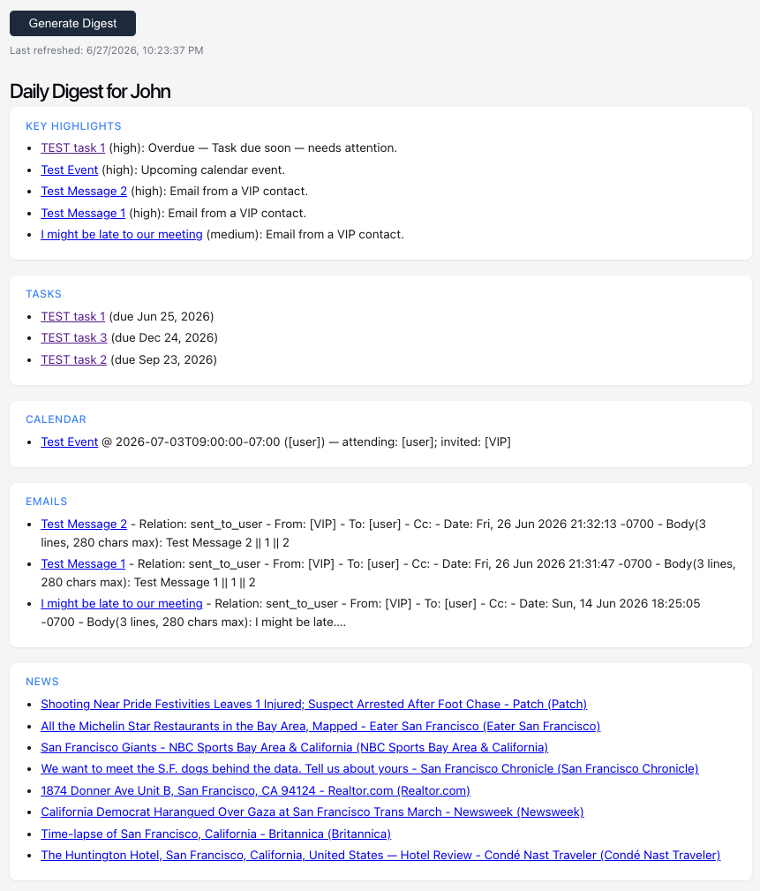
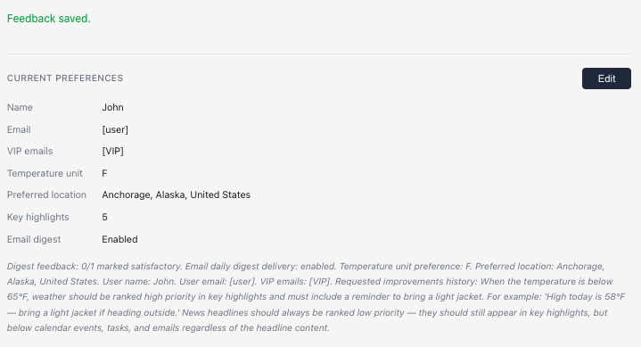
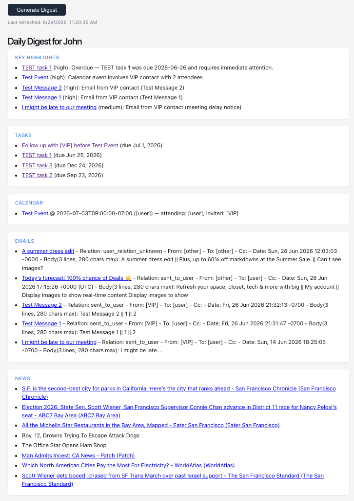
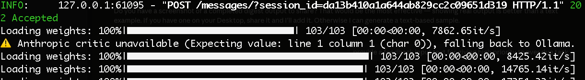

# Daily Digest Agent: Autonomous Morning Briefings for Busy People

> **For the teaching assistant:** This is a CMU Agentic AI capstone project (Carnegie Mellon University, School of Computer Science, Executive Education — Agentic AI Program). This README is written to help you run and evaluate the project locally from scratch. Follow the sections in order — System Requirements → Prerequisites → Quickstart → Environment Variables → Google Services Setup → Run. Everything needed to get the app running is covered here.

## Problem

Busy people who rely on multiple digital tools to manage their day face a common friction: first thing in the morning they bounce between email, calendar, tasks, weather, and news to figure out what matters. Important meetings and follow-ups can be buried, and the process is time-consuming and mentally draining. Missed appointments, late responses, and weak daily prioritization create stress and reduce effectiveness.

## What It Does

**Daily Digest Agent** solves this by generating a single prioritized morning briefing. At a glance, the user can see:

- Today's most important meetings and potential conflicts
- Email threads that likely need attention
- Follow-up tasks and reminders, including overdue items
- Relevant external context such as weather and news headlines

Successful performance means the user no longer needs to open Gmail, Calendar, and Tasks separately first thing in the morning. The digest surfaces "what really matters today" instead of everything that happened overnight.

The agent connects to your personal Google account via OAuth 2.0 (read-only for Gmail and Calendar; read/write for Tasks to create follow-up reminders). Raw personal data never reaches a third-party LLM API — the Ranking Strategist runs on an Ollama endpoint under your control (local machine or a private server), and only sanitized item IDs are sent to Claude for evaluation. The system assumes Google credentials, the workflow controller, and the vector store are available; if they are not, it fails fast rather than silently degrading.

The ranking pipeline works as follows:

- **L1** — Ranking Strategist (Ollama/qwen3:8b) generates 5 candidate rankings; Ranking Critic (Claude) scores all 5 and prunes to the top 2
- **L2** — Strategist refines each of the 2 survivors into 2 variants (4 leaf candidates total); Critic selects the best one to synthesize into the final digest

This two-level search was motivated by quality: a single-pass ranking produced inconsistent results, while the L1→prune→L2→select pattern significantly improved coherence and prioritization.

Two different LLMs are used deliberately — each matched to its role:
- **Ranking Strategist → Ollama/qwen3:8b (controlled infrastructure):** Generation is the high-volume work — 5 candidates at L1, 4 refinements at L2. The Strategist runs on an Ollama endpoint you control — a local machine for development, or a private EC2/VPC instance in production. The privacy guarantee is about network egress, not physical location: raw personal data never reaches a third-party API. Changing `OLLAMA_BASE_URL` is all that's needed to move from laptop to a dedicated GPU server. The Strategist receives at most ~24 items total (calendar capped at 5, email at 5, tasks at 5, news at 8, plus weather and location context). Each item is sanitized before being sent — raw email bodies and calendar details are stripped and replaced with short natural-language context strings — so the actual prompt size stays well under 10K tokens even on a busy day. A model with 8K context would be sufficient for the current bounded inputs; qwen3:8b's 40K context is not a hard requirement but provides headroom if caps are raised. In a real production environment where more items per source are needed, the caps can be raised in `fetcher_agent.py` — but a pre-filtering or summarization step should be added to keep the prompt within bounds rather than relying on a larger context window.
- **Ranking Critic → Claude (cloud):** Scoring and selection require stronger reasoning and coherence judgment than a local 8B model can reliably provide. The default model is `claude-haiku-4-5-20251001`, overridable via `ANTHROPIC_MODEL`. While Claude Opus is the most capable model in the family, the Critic's task does not warrant it — the Critic only receives sanitized item IDs, source types, and priority scores. There is no ambiguous content to interpret, no long context to reason over, and no creative output required. The evaluation is structured and narrow: does this ranking make coherent priority choices? Haiku handles this reliably at significantly lower latency and cost. Opus would add 3–5 seconds per scoring call with no measurable improvement in ranking quality for this specific task. The rule of thumb applied here: match model capability to task complexity — use the most powerful model where it matters, and the fastest model where structure does the work.

This **controlled-infrastructure-for-generation, cloud-for-evaluation** pattern is directly applicable to real enterprise environments where sensitive internal data (emails, documents, customer records) cannot be sent to public cloud LLM APIs due to compliance, data residency, or confidentiality requirements. The Strategist runs on infrastructure you control; the cloud model only sees abstracted, sanitized signals. In production this would be a private GPU server or VPC-isolated instance — not a developer laptop — but the architecture is identical.

> **A note on scope:** This project is deliberately over-engineered. A working daily digest could be built with a single LLM call. The goal here was to learn by doing — exploring LangGraph, CrewAI, FastMCP, episodic memory, shadow mode agent evaluation, and two-level Tree-of-Thought search all in one project. If something seems more complex than it needs to be, that's intentional.

## System Requirements

| | Minimum | Recommended |
|---|---|---|
| **OS** | macOS 12+ or Linux | macOS (Apple Silicon M1+) |
| **RAM** | 8 GB | 16 GB |
| **Disk** | 6 GB free | 10 GB free |
| **CPU** | Any modern x86-64 or ARM | Apple Silicon (M1+) — Ollama uses the GPU, making inference 3–5× faster |
| **Internet** | Required | — |

> **RAM note:** The local LLM (`qwen3:8b`) alone occupies ~5GB of RAM. On an 8GB machine the OS may swap under load; 16GB gives comfortable headroom.

## Prerequisites

Install these before cloning:

| Tool | Version | Install |
|---|---|---|
| **Python** | **3.12 exactly** | [python.org](https://www.python.org/downloads/) or `brew install python@3.12` |
| **Node.js** | 18+ | [nodejs.org](https://nodejs.org/) or `brew install node` |
| **Ollama** | latest | [ollama.com](https://ollama.com/) — install the Mac app or `brew install ollama` |
| **git** | any | pre-installed on macOS; or `brew install git` |

> **Python 3.12 is required.** The setup script calls `python3.12` explicitly to create the virtual environment. Other versions will fail.

Verify your versions before proceeding:

```bash
python3.12 --version   # must print Python 3.12.x
node --version         # must print v18 or higher
ollama --version       # any version
```

After installing Ollama, pull the recommended model (≈5GB download):

```bash
ollama pull qwen3:8b
```

> **Why qwen3:8b?** It has a 128K context window — large enough to hold a full day's worth of emails, calendar events, and tasks in a single prompt. Most other 8B models top out at 8K–32K, which causes truncation on busy days and significantly degrades ranking quality (this was observed firsthand during development — smaller context models produced poor, incomplete digests). qwen3:8b also benchmarks well on instruction-following tasks, which matters for the Tree-of-Thought ranking steps.
>
> **qwen3 thinking mode:** qwen3 runs in thinking mode by default — it generates an internal chain-of-thought before responding. For strict JSON schema compliance this is counterproductive: the model spends its reasoning budget reinterpreting the schema rather than following it literally, producing inconsistent key names across runs. The system disables thinking mode via `think: false` in the Ollama API options and `/no_think` prompt prefixes, which makes the model respond directly and follow the schema reliably.

> **Note:** News (Google News RSS) and weather (open-meteo) are free public APIs — no keys required.

## Quickstart

```bash
# 1. Clone the repo
git clone https://github.com/johndklee/cmu-agentic-ai.git
cd cmu-agentic-ai

# 2. Install Python dependencies including CrewAI (creates .venv312/)
bash scripts/setup_claude_code.sh --with-crewai

# 3. Install Node dependencies
cd web && npm install && cd ..

# 4. Create .env (see Environment Variables section below)
cp .env.example .env   # then fill in your keys

# 5. Set up Google credentials (see Google Services Setup section below)

# 6. Run
./run.sh
```

The app runs at **http://localhost:8000**. At startup it shows a diagnostics panel confirming all services are connected.

> **First run note:** On first startup the embedding model (`sentence-transformers/all-MiniLM-L6-v2`, ~90MB) downloads automatically from HuggingFace. The app will appear to hang for 30–60 seconds with no output — this is normal. Subsequent starts are instant. The model is loaded once at server startup and shared across all retrieval calls via a module-level singleton — it is not reloaded on each digest run.


> **macOS/Linux only.** `run.sh` requires zsh. On Windows, start Ollama manually and run the backend and frontend separately (see Run section below).

## Environment Variables

Copy `.env.example` to `.env` and fill in your keys. This file is in `.gitignore` and will never be committed.

```bash
cp .env.example .env
```

| Variable | Required | Description |
|---|---|---|
| `ANTHROPIC_API_KEY` | **Yes** | Claude API key for the Ranking Critic — get at [console.anthropic.com](https://console.anthropic.com) |
| `OLLAMA_MODEL` | **Yes** | Local model for the Ranking Strategist — e.g. `qwen3:8b` |
| `OLLAMA_BASE_URL` | No | Ollama server URL (default: `http://localhost:11434`) |
| `OLLAMA_NUM_CTX` | No | Context window override (uses model default if not set) |
| `OLLAMA_REQUEST_TIMEOUT_SECONDS` | No | Ollama request timeout in seconds (default: `300`). Increase on slower machines to avoid L2 refinement timeouts. |
| `HF_TOKEN` | No | HuggingFace token for higher download rate limits — get at [huggingface.co/settings/tokens](https://huggingface.co/settings/tokens) |
| `GALILEO_OBSERVABILITY_ENABLED` | No | Set to `1` to emit LLM trace events to Galileo |
| `GALILEO_API_KEY` | No | Required when Galileo observability is enabled |
| `GALILEO_CONSOLE_URL` | No | Your Galileo project URL |
| `GALILEO_INCLUDE_CONTENT` | No | Set to `1` to include raw prompt/response in Galileo events |

## LLM Configuration

The two agents use different models — this section explains how to configure them and what each env var controls at runtime.

Runtime model configuration is per-agent:

- Strategist uses Ollama (`OLLAMA_MODEL`, default `llama3.1:8b`)
- Critic uses Claude (`ANTHROPIC_MODEL`, default `claude-haiku-4-5-20251001`)
- `OLLAMA_BASE_URL` and `OLLAMA_NUM_CTX` tune Ollama runtime behavior
- Optional Galileo observability:
	- `GALILEO_OBSERVABILITY_ENABLED=1` enables event emission (no-op when Galileo SDK is not installed)
	- `GALILEO_INCLUDE_CONTENT=1` includes raw prompt/response content in events
	- Default behavior is metadata-only (`prompt_chars`, `response_chars`, hashes, latency, status)

## Google Services Setup

The agent reads Gmail, Google Calendar, and Google Tasks via OAuth 2.0. Tasks also requires **write** access — the agent automatically creates follow-up tasks when a VIP attendee on a calendar event has a recent email thread. Setup is one-time and must be completed before the first run.

The following OAuth scopes are requested:

| Scope | Why |
|---|---|
| `gmail.readonly` | Read inbox for email ranking |
| `gmail.send` | Send the daily digest email (if opted in) |
| `calendar.readonly` | Read upcoming events for ranking |
| `tasks` | Read open tasks + create VIP follow-up tasks (read/write) |

**1. Create a Google Cloud Project**
- Go to [console.cloud.google.com](https://console.cloud.google.com) and create a new project

**2. Enable the APIs**
- Go to **APIs & Services → Library** and enable:
  - Gmail API
  - Google Calendar API
  - Tasks API

**3. Create OAuth 2.0 Credentials**
- Go to **APIs & Services → Credentials → Create Credentials → OAuth client ID**
- If prompted, configure the OAuth consent screen first:
  - User type: **External**
  - Add your Google account email as a test user
  - Add the four scopes listed above under **Scopes**
- Application type: **Desktop app**
- Click **Create** then **Download JSON**
- Rename the downloaded file to `credentials.json` and place it in the project root

**4. Authenticate**
- Run the app — a browser window will open asking you to sign in with Google
- Google will show a **"This app isn't verified"** warning screen — this is expected for a personal Cloud project in test mode. Click **Advanced** → **Go to (project name) (unsafe)** to proceed
- Approve all requested permissions including Tasks read/write — this is required for VIP follow-up task creation
- After approving, `token_google.json` is saved automatically
- Subsequent runs authenticate silently with no browser prompt

Both `credentials.json` and `token_google.json` are in `.gitignore` and will never be committed.

## Ports

| Port | Service | Notes |
|---|---|---|
| **8000** | FastAPI backend + served frontend | Main app URL in production — `http://localhost:8000` |
| **5173** | Vite dev server (frontend only) | Only used when running frontend separately with `npm run dev` |
| **8001** | FastMCP branch state server | Internal only — used by LangGraph nodes to share ToT candidate state; not exposed to the browser |
| **11434** | Ollama | Local LLM server — used by the Ranking Strategist agent |

`run.sh` kills any existing processes on ports 8000 and 8001 before starting.

## Run

```bash
./run.sh
```

This starts Ollama (if not already running), builds the frontend, and launches the FastAPI backend on port 8000.

Or start backend and frontend separately in dev mode:

```bash
.venv312/bin/uvicorn server:app --reload   # backend on :8000
cd web && npm run dev                       # frontend on :5173
```

## Your First Daily Digest

Once the app is running at **http://localhost:8000**:

1. **Check diagnostics** — the Diagnostics panel loads automatically. Confirm all sections show green before proceeding. Fix any red items (missing credentials, Ollama not reachable, etc.)

2. **Set your preferences** — expand the **Current Preferences** panel and click **Settings**:
   - Enter your name and email address
   - Set your location (used for weather)
   - Add VIP email addresses (people whose emails get priority in ranking)
   - Choose temperature unit and number of key highlights
   - Check **Email daily digest** to receive the digest in your inbox after each run — the digest is sent from and to the email address you entered above, which must be the same Google account you authorized during Google OAuth setup

3. **Generate your first digest** — go back to the main page and click **Generate Digest**
   - Each pipeline step streams live as it runs — completed steps show a checkmark, the active step shows a spinner with the LLM being used

   

   - The pipeline runs: fetches Gmail, Calendar, Tasks, News, and Weather → L1 ToT generates 5 rankings → Critic prunes to top 2 → L2 ToT refines to 4 leaf candidates → Critic selects best → synthesizes final digest
   - First run takes 1–2 minutes as the LLM processes all candidates
   - The digest appears on screen when complete
   - The terminal running `run.sh` prints diagnostic output during the run — this is normal and useful for understanding pipeline behavior:
     - `[strategist]` lines show the raw LLM output length, valid item IDs, and how many candidates passed validation
     - `[synthesize]` lines confirm how many ranking entries the selected candidate has
     - `[refine_candidate]` lines report any L2 refinement failures (timeouts or parse errors) — the pipeline recovers automatically via fallback

   

4. **Submit feedback** — after reviewing the digest, a feedback form appears at the bottom. Rate the digest with a thumbs up or down. Clicking thumbs down expands a text field to describe what to improve — this note is stored in episodic memory and used to influence future rankings.

   

   The more specific the feedback, the better — the episodic memory matches on keywords from the current run context. Corrections are applied in two ways: soft (included in the LLM prompt as mandatory rules) and hard (enforced deterministically in Python after candidate selection, regardless of LLM output).

   **Hard-coded rules (always enforced, not configurable via feedback):**
   - Overdue tasks are forced to `high` priority and injected at the top of key highlights — even if the Strategist omitted them entirely
   - When a VIP calendar attendee also has a recent email thread, a Google Tasks follow-up reminder is created automatically — this is deterministic Python logic, not LLM-driven. It is idempotent (a marker in the task notes prevents duplicates across runs)

   **Soft rules (feedback-driven, LLM is instructed but not guaranteed):**
   - Everything stored in episodic memory — weather priority, news ranking, jacket reminders, VIP emphasis — is retrieved and injected into the Strategist prompt as mandatory instructions. The LLM usually follows them, but soft rules can be missed if the similarity retrieval score is low, if the prompt is too long, or if the model drifts under conflicting signals. If a correction is critical enough to always apply, it should be promoted to a hard rule in code rather than left as a soft prompt instruction.

   **How user preferences interact with enforcement:**

   User preferences (stored separately in `preferences.py`) and episodic memory corrections are distinct — preferences control identity and display settings, episodic memory stores natural language feedback corrections. They interact with enforcement differently:

   | Preference | Applied as |
   |---|---|
   | VIP email addresses | Soft — passed to Strategist prompt; LLM is told to prioritize but not guaranteed |
   | Number of highlights | Hard — digest is sliced to exactly this count in Python after selection |
   | Temperature unit | Hard — applied at render time in Python, not LLM-controlled |
   | Episodic feedback corrections | Soft — retrieved by similarity and injected into prompt; LLM-dependent |

   For example:

   > *"When the temperature is below 65°F, weather should be ranked high priority in key highlights and must include a reminder to bring a light jacket. For example: 'High today is 58°F — bring a light jacket if heading outside.'*
   >
   > *News headlines should always be ranked low priority — they should still appear in key highlights, but below calendar events, tasks, and emails regardless of the headline content."*

   

   After submitting, the feedback is confirmed and the Current Preferences panel updates to show the full correction stored in episodic memory:

   

   On the next run, the agent applies the correction — weather is ranked high priority with a jacket reminder, and news is ranked low:

   

> **Last run persistence:** On first launch there is no cached digest — the main page will be blank until you generate one. After the first successful run, the digest is stored and displayed automatically on every subsequent load. You do not need to regenerate it each time.

## Safety & Design Decisions

### Privacy Boundary (Structural)

Personal data is sanitized at two points before it reaches any LLM:

- **Strategist (Ollama/local):** `_sanitize_items_for_llm()` in `ranking_strategist.py` converts raw signal flags (e.g. `attendee_is_vip: true`) into natural-language context hints (e.g. `"involves a VIP contact"`) before items are sent to qwen3. Raw field names never appear in the prompt, preventing the model from echoing internal keys into the digest output.
- **Critic (Claude/cloud):** `prompt_redaction.py` strips all personal content before the API call. Claude only receives sanitized item IDs, sources, and priority scores — no email content, sender names, event titles, or task details.

Both boundaries are enforced in code, not policy — neither model can receive raw personal data regardless of what other parts of the system do.

### Email Address Masking (UI and Email Digest)

Email addresses are masked in two places: the web UI and the emailed digest. In both, every email address in task titles, calendar organizer and attendee fields, email from/to/cc fields, and the Current Preferences panel summary is replaced with a masked label:

- `[user]` — the configured user's own email address
- `[VIP]` — an address on the user's VIP list
- `[other]` — any other third-party address

The raw addresses are preserved in Google Tasks/Calendar/Gmail and in the internal observation strings used by the LLM — only the display layer applies the substitution. This prevents accidental PII exposure in the UI without affecting the agent's ability to reason about contacts.

### LLM Output Validation

All outputs from the Ollama strategist are validated before use:
- Priority values are checked against an allowlist (`high`, `medium`, `low`)
- Item IDs are checked against the set of actually fetched items
- Candidates with invalid entries are silently dropped
- If fewer than 5 valid candidates are returned or JSON is unparseable, a deterministic fallback ranking is substituted
- Coherence scores are clamped to `[0.0, 1.0]` regardless of source
- If both Claude and the Ollama fallback fail, the critic returns a neutral score of `0.5` so the pipeline continues using deterministic scoring dimensions alone

When the Anthropic API is unavailable, the terminal logs the fallback clearly and the pipeline continues uninterrupted using Ollama as the critic:



### Data Scope Limits

To prevent context overflow and scope creep:
- Calendar queries are bounded to **31 days ahead**
- Email body previews are capped at **3 lines / 280 characters**; HTML and URLs are stripped
- Calendar, email, and tasks sources are each capped at **5 items**; news fetches up to **8 articles**
- The ranking LLM receives at most ~**24 items total**

### Human Intervention Boundaries

The agent never modifies its own behavior autonomously. Human action is required at three boundaries:

- **Memory writes** — episodic memory is only updated when the user explicitly submits feedback via the web UI after reviewing the digest. Automatic saving was considered and rejected: if a run is poor quality, saving it automatically would teach the agent the wrong lessons.
- **Preference changes** — location, VIP contacts, highlight count, and digest preferences are only saved through the Settings UI or the post-digest feedback form on explicit user action.
- **Shadow promotion** — the key highlights shadow agent never auto-promotes. Promotion requires two consecutive passing weekly quality reports; a human must observe the metrics trend before any behavioral change takes effect.

### Scoped Autonomy Exception: VIP Task Creation

The one autonomous write the agent performs is creating a Google Task when a VIP attendee on a calendar event also has a recent email thread — a reminder to follow up before the event. This is bounded by three constraints: it only triggers on the explicit VIP+email overlap condition, it is idempotent (a deterministic marker in the task notes prevents duplicates across runs), and it creates a reminder rather than taking action on the user's behalf.

### Evaluation Metrics

The following are tracked or observable:

| Metric | Description | Gate |
|---|---|---|
| Fallback rate | % of runs where deterministic fallback replaced LLM candidates | — |
| Schema validity rate | % of shadow agent outputs that are correctly formatted | ≥95% |
| Promotion pass rate | % of shadow outputs good enough to replace the current approach | ≥70% |
| Timeout rate | % of shadow calls exceeding the 2.5s timeout | ≤5% |
| Pipeline completion rate | % of runs reaching the feedback node without a RuntimeError | — |
| Episodic correction utilization | ChromaDB corrections retrieved per run (zero = retrieval not matching) | — |
| User satisfaction rate | Ratio of satisfied to total feedback submissions | — |

### Does Agent Quality Degrade Over Time?

This was a deliberate design concern. Several mechanisms work together to prevent it:

- **Episodic memory is write-protected from bad runs** — corrections are only stored when the user explicitly submits feedback after reviewing the digest. A failed or low-quality run teaches the agent nothing.
- **Recency weighting decays stale corrections** — stored feedback loses influence over time (full weight ≤30 days, 0.75x ≤60 days, 0.55x older, flagged stale beyond that). Outdated preferences don't permanently skew future rankings.
- **Shadow promotion requires sustained quality** — Agent B cannot replace the deterministic highlights path unless it passes quality gates over two consecutive weekly reports. A single good run is not enough.
- **LLM output is validated every run** — malformed or out-of-range outputs are caught and replaced with deterministic fallbacks rather than being passed downstream.
- **Hard item limits prevent context drift** — the ranking prompt is bounded to ~24 items regardless of how much data accumulates in Gmail or Calendar over time.

The net effect is that the agent can improve through feedback but has no mechanism to silently degrade — quality changes require either explicit user action or sustained metric improvement.

### Key Trade-offs

- **Autonomy vs. reliability:** The agent halts rather than produces output under uncertain conditions. A failed run is preferable to a plausibly incorrect one.
- **Efficiency vs. privacy:** Stripping personal data from critic inputs removes context that might improve coherence scoring. The privacy guarantee was prioritized — the boundary is structural and cannot be bypassed by model output.
- **Automation vs. oversight:** Requiring explicit user feedback for episodic memory updates slows learning. A user who never submits feedback always gets default behavior. This trade-off was accepted because automatic learning from implicit signals would require behavioral tracking that raises its own privacy concerns.

## Maintenance

Reset preferences if needed:

```bash
.venv312/bin/python main.py --reset-preferences digest
```

## Tests

```bash
.venv312/bin/python -m unittest discover -s tests -p "test_*.py"
```

## Shadow Metrics Ops

**Agent A vs. Agent B — what's being compared:**

- **Agent A** is the full main pipeline — LangGraph workflow, Strategist + Critic, two-level Tree-of-Thought ranking. It produces the key highlights the user actually sees.
- **Agent B** is a simpler, focused agent defined in `key_highlights_agent.py`. It receives the already-fetched digest data and produces an alternative highlights list using a single-pass LLM call rather than the full ToT search.

The architectural question shadow mode is designed to answer over time: *does the complexity of L1→prune→L2→select actually produce meaningfully better key highlights than a simpler single-pass approach?* If Agent B consistently matches Agent A's output with high overlap and passes all quality gates, it suggests the ToT pipeline's complexity may not be adding value for highlights specifically — and Agent B could replace that step with significantly lower latency. If Agent B diverges or misses important items, Agent A's approach is validated.

Tweaks are made to Agent B only — Agent A continues unchanged. The comparison is always Agent B vs. the current Agent A output on the same run.

The shadow mode agent (Agent B) runs silently alongside every digest run and logs its output to `.memory/key_highlights_shadow.jsonl`. These commands exist to monitor whether Agent B is performing well enough to replace the current deterministic key highlights approach. Before any PR that changes shadow behavior, the CI snapshot must be refreshed locally — otherwise the CI gate will fail.

The full two-agent contract — including input/output schemas, validation rules, rollout phases, CI gate runbook, and threshold raise policy — is documented in [`docs/two-agent-contract.md`](docs/two-agent-contract.md). The system is currently in **Phase 1** (shadow mode): Agent B runs on every digest but its output is never shown to the user until promotion gates pass.

Prepare the CI contract log snapshot:

```bash
.venv312/bin/python scripts/prepare_ci_shadow_log.py --source .memory/key_highlights_shadow.jsonl --output ci/key_highlights_shadow.jsonl --tail 50
```

Summarize shadow metrics and write a JSON report:

```bash
.venv312/bin/python scripts/summarize_shadow_metrics.py --log-path ci/key_highlights_shadow.jsonl --tail 50 --output-json reports/latest_shadow_metrics.json
```

Enforce quality gates locally (non-zero exit on failure):

```bash
.venv312/bin/python scripts/summarize_shadow_metrics.py --log-path ci/key_highlights_shadow.jsonl --tail 50 --min-records 10 --min-valid-rate 0.95 --max-timeout-rate 0.05 --min-promotion-pass-rate 0.70 --enforce-gates
```

**Side-by-side comparison of Agent A vs Agent B highlights** (last 5 runs):

```bash
.venv312/bin/python scripts/compare_shadow_highlights.py
```

Use `--tail N` to show more runs, `--log-path` to point at a different log file. Each run shows Agent A's actual highlights alongside Agent B's alternative, with overlap ratio and ordering changes.

## Design Evolution

The system went through four distinct stages across the capstone program:

1. **ReAct loop (Module 1–2)** — a single LLM loop that both "thought" and "acted." The agent chose which tool to call next, read results, and continued reasoning inside one large prompt. There was no persistent memory, minimal structure, and most control lived inside the model.

2. **Episodic memory added (Module 3)** — ChromaDB was integrated before other orchestration changes. The agent began storing embeddings of past runs and corrections and retrieving them at query time. This turned the system from a stateless ReAct loop into something that could use context and recency when deciding what to highlight.

3. **LangGraph workflow + MCP state (Module 4–5)** — the implicit ReAct loop was replaced with an explicit workflow graph and MCP-style state tracking. Nodes now fetch data, build rankings, run a critic, synthesize the digest, and capture feedback, each with narrow responsibilities and precondition checks. The single agent became a strategist + critic design with a clear privacy boundary between them.

4. **Safety, validation, and observability (Module 6)** — informed by the safety checkpoint, the final layer added structural privacy enforcement for the critic, validation and deterministic fallbacks around all LLM outputs, startup diagnostics, and shadow metrics with explicit quality gates. The result is a workflow-driven, multi-agent system with explicit memory, safety, and observability — rather than a single opaque loop.

## Architecture Overview

The app has two processes that run together:

**Backend** (`server.py` — FastAPI, port 8000)
Hosts all business logic: the LangGraph workflow, CrewAI agents, Google API calls, episodic memory, and the FastMCP branch state server. Exposes a REST + Server-Sent Events API that the frontend consumes. The digest generation pipeline runs entirely here.

**Frontend** (`web/` — React + Vite, served from port 8000 in production)
A single-page React app that provides the UI: the Diagnostics panel, digest display with live streaming progress, preferences/settings, and feedback form. In development mode it runs on port 5173 and proxies API calls to the backend on 8000.

## Framework Roles

Each framework has a distinct responsibility in the pipeline:

| Framework | Role |
|---|---|
| **LangGraph** | Orchestrates the end-to-end workflow as a directed graph — manages node sequencing, conditional routing (e.g. critic decides whether to refine or proceed), and state passing between steps |
| **LangChain Core** | Provides the LLM client abstraction used by the Critic to call Claude; also supplies tool-calling utilities used during candidate scoring |
| **CrewAI** | Defines the **Ranking Strategist** agent (uses Ollama/qwen3:8b to generate and refine candidate rankings) and manages its role definition and LLM binding. The Ranking Critic calls Claude directly via the Anthropic API rather than through a CrewAI crew — this avoids subprocess spawning overhead that was causing the embedding model to reload on every scoring call |
| **FastMCP** | Runs a lightweight MCP (Model Context Protocol) server on port 8001 that tracks Tree-of-Thought branch state across workflow steps — specifically: storing the 5 L1 candidate rankings, recording Critic scores and pruning decisions, and tracking L2 refinement rounds. This gives each agent a shared, structured view of the ToT search tree without passing large blobs through LangGraph state |
| **ChromaDB** | Vector database that persists episodic memory — stores user feedback corrections as embeddings so past preferences can be retrieved and applied to future digests |
| **Sentence Transformers** | Embedding model (`all-MiniLM-L6-v2`) that converts feedback text into vectors for storage and similarity search in ChromaDB |
| **HuggingFace** | Model hub where the embedding model is downloaded from on first run. No account required — the model is public — but setting a `HF_TOKEN` avoids download rate limits that can slow or block the first startup |
| **Ollama** | Local LLM server that hosts qwen3:8b on your machine. The Ranking Strategist sends prompts to Ollama via HTTP — no data leaves your machine for the local model |
| **Prompt Redaction** | Two-layer privacy boundary: `_sanitize_items_for_llm()` in `ranking_strategist.py` converts raw signal flags to natural-language hints before the Strategist (Ollama) sees items; `prompt_redaction.py` strips all personal content before the Critic (Claude) is called. Neither model receives raw email addresses, names, or contact details |
| **Critic Tools** | The Ranking Critic doesn't rely purely on LLM judgment — `critic_tools.py` provides deterministic LangChain tool wrappers (e.g. schema validation, overlap scoring) that the Critic calls during candidate evaluation. This makes scoring more consistent and auditable |
| **Digest Rendering** | `digest_rendering.py` is a deterministic fallback renderer. If the LLM returns malformed or unparseable output, the pipeline falls back to this to produce a valid digest from raw observations rather than failing |
| **Shadow Mode** | `key_highlights_agent.py` runs a silent parallel Agent B alongside the main pipeline to generate and validate an alternative key highlights output. Results are logged to `.memory/key_highlights_shadow.jsonl` for quality tracking but never shown to the user — used to evaluate whether Agent B is ready to replace the current approach. The motivation: replacing one agent's behavior with another is risky if done all at once. Shadow mode runs the new agent in parallel for every digest, validates its schema, measures overlap with the current output, and tracks quality metrics over time. Only when the agent passes sustained quality gates (schema validity ≥95%, timeout rate ≤5%, promotion pass rate ≥70% over two consecutive weekly reports) is a human allowed to promote it. This pattern — run silently, measure, gate, then promote — is a standard technique for safely replacing agent behavior in production without disrupting users |
| **Galileo** | Optional LLM observability platform. When enabled (`GALILEO_OBSERVABILITY_ENABLED=1`), emits trace events (latency, token counts, node timings) for every LLM call to a Galileo dashboard — useful for debugging and tuning the pipeline |

In short: LangGraph is the workflow engine, CrewAI defines the agents and their models, LangChain is the LLM interface layer, FastMCP shares ToT branch state, ChromaDB + Sentence Transformers power episodic memory, Ollama keeps the Strategist local, and Galileo provides optional observability into every LLM call.

## Module Layout

- `main.py`: application entrypoint and startup diagnostics.
- `workflow_controller.py`: LangGraph workflow assembly and execution.
- `user_interactions.py`: identity setup, digest feedback capture, and optional digest email delivery.
- `episodic_context.py`: run-context tracking and retrieval query construction from current observations.
- `memory_store.py`: episodic memory persistence/retrieval with Chroma vector backend (vector-only).
- `actions/`: tool integrations for external data sources and deterministic helper actions.
	- `location_action.py`, `time_action.py`, `weather_action.py`, `news_action.py`: location and environmental context.
	- `calendar_action.py`, `email_action.py`, `tasks_action.py`: Google Calendar/Gmail/Tasks read-write integrations.
	- `key_highlights_action.py`: attendee-email overlap analysis and follow-up task creation.
	- `daily_digest_action.py`: structured digest scaffold metadata (title, date/time, section availability).
	- `google_services.py`: shared Google OAuth/service client bootstrap and error formatting.
- `preferences.py`: local preference persistence and summarization logic.

## Evaluation Artifacts

The following artifacts are committed to the repository for reviewers who cannot run the project locally:

| Artifact | Location | Description |
|---|---|---|
| Shadow metrics snapshot | `ci/key_highlights_shadow.jsonl` | Last 50 shadow agent runs used by the CI quality gate |
| Shadow metrics report | `reports/latest_shadow_metrics.json` | Summarized quality gate results from the snapshot |

Current shadow metrics (as of last commit):
- **Schema validity rate:** 100% (gate: ≥95%)
- **Timeout rate:** 0% (gate: ≤5%)
- **Promotion pass rate:** 100% (gate: ≥70%)
- **Average overlap with deterministic output:** 100%
- **All gates:** PASS

## Evaluation

Evaluation covered both usefulness and reliability.

**Usefulness** was assessed by running the agent on a mix of synthetic and real days and manually checking whether the digest:
- Surfaced the most important meetings and VIP-related email threads
- Produced key highlights that felt focused rather than noisy
- Reduced the need to open Gmail, Calendar, and Tasks first thing in the morning

The web UI feedback form collected satisfaction ratings and short comments, which guided refinements to ranking thresholds and section layout.

**Reliability** was assessed through:
- Unit tests for episodic memory indexing and retrieval (`tests/`)
- Startup diagnostics confirming the workflow controller, ChromaDB backend, and Google credentials are available before each run
- A shadow key highlights agent evaluated via `scripts/summarize_shadow_metrics.py`, which computes schema validity rate, promotion pass rate, and timeout rate with explicit CI quality gates

**Results:** In practice the system produced structured, readable daily digests that reliably highlighted core meetings and important email threads and helped reduce early-morning context-switching. Remaining issues include sensitivity to misconfiguration (missing credentials halt the pipeline with a clear error) and longer-than-ideal digests on very busy days when all item caps are hit.

## Limitations and Next Steps

**Current limitations:**
- **Narrow data sources** — the system covers Gmail, Calendar, Tasks, weather, and news. It may miss important signals from tools such as CRMs, ticketing systems, Slack, or documentation platforms.
- **Basic personalization** — the agent respects stated preferences and uses episodic memory for corrections, but does not deeply model long-term goals, project structure, or subtle sender priorities beyond the VIP list.
- **Modest evaluation** — evaluation relies on unit tests, startup diagnostics, and shadow metrics rather than a large labeled dataset of good and bad digests.
- **Latency** — the multi-agent, multi-step workflow adds complexity and latency compared to a single-prompt summarizer. First run takes 1–2 minutes.
- **Single-tenant only** — the current design assumes one user, one set of credentials, and one shared data store. ChromaDB paths, preference collections, episodic memory, and Google OAuth tokens are all unnamespaced — there is no tenant isolation. Extending to multi-tenant would require: per-user scoped ChromaDB collections to prevent episodic corrections bleeding across users; per-user OAuth token storage with a secure credential vault; per-tenant or per-company Ollama instances (or a shared GPU server with strict request isolation) to maintain the privacy boundary; and a tenant identity registry to correctly scope PII masking. The Ollama/controlled-infrastructure model works for multiple internal users within the same trust boundary — for a multi-company SaaS deployment, per-tenant infrastructure isolation would be required.
- **Soft rule reliability** — corrections stored in episodic memory are injected into the LLM prompt but not guaranteed to be followed. A critical preference can be silently ignored if the retrieval similarity score is low, the prompt is too long, or the model drifts under conflicting signals. There is no alerting when a retrieved correction was not applied in the final output.
- **Cold start problem** — episodic memory is empty on first run. The agent has no personalized behavior until several feedback cycles accumulate. Early digests reflect only hard-coded rules and VIP preferences, not learned corrections.
- **No conflict resolution** — if two episodic corrections contradict each other (e.g., "always rank weather high" and "only show 3 items"), the LLM decides which wins with no deterministic tie-breaking. Conflicting corrections can produce unpredictable ranking behavior.
- **No session or intent awareness** — the agent does not know if the user is traveling, in a crunch week, or on vacation. Context is limited to what is present in the current calendar, tasks, and email fetch — there is no higher-level awareness of the user's current mode or goals.

**Realistic next steps:**
- Integrate additional tools (Slack, Linear, CRM) while preserving privacy guardrails
- Deepen personalization based on feedback patterns and long-term episodic context
- Expand evaluation with more synthetic and real-world scenarios and automated quality dashboards
- Optimize runtime through parallel tool calls, lighter models for non-critical steps, and prompt and context tuning

## Notes

- Local sensitive files are intentionally ignored via `.gitignore` (`.env`, credentials/token files, `.memory/`, and local preference state).
- Episodic retrieval is recency-aware with stale-signal handling for older corrections.
- Episodic retrieval and writes are vector-only; vector backend unavailable is a hard error.
- `run.sh` requires macOS or Linux (zsh).

